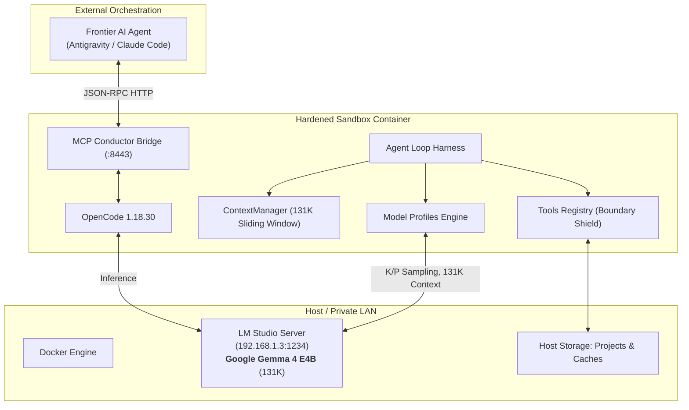

# xl-sandboxed-opencode

`xl-sandboxed-opencode` is a hardened, containerized local development environment pairing local and LAN open-weights reasoning models with strict host isolation, agent loops, model profiles, and conductor orchestration.

The flagship configuration is tuned for **Google Gemma 4 E4B** running via LM Studio with a **131,072-token context window**, native tool calling, reasoning trace extraction, and structured outputs.

---

## What's New in This Release

- **Flagship Model Profile: Google Gemma 4 E4B**:
  - Declarative profile in `config/model_profiles/gemma-4-e4b.json`.
  - Tuned sampling: `temperature: 0.2`, `top_p: 0.95`, `top_k: 40`, `min_p: 0.05`.
  - 131,072 max context window with sliding history budgeting.
  - Native OpenAI function calling & strict JSON Schema structured output.
  - Dedicated reasoning token budget (4,096 tokens) and thought trace isolation.
- **Harness & Agent Loops Engine (`harness/`)**:
  - Multi-turn autonomous agent loop runner (`AgentLoopRunner`).
  - Context budget manager (`ContextManager`) with sliding history pruning.
  - Automated project evaluation and testing quality gate (`TaskEvaluator`).
  - Programmatic task runner CLI (`scripts/run_harness.py`).
- **Flexible Network & Endpoint Routing**:
  - `LLM_HOST`: support connecting to private LAN model endpoints (e.g. `192.168.1.3:1234`) without granting unrestricted WAN egress.
  - Restricted internal network mode (`make run-restricted`).
- **Skills, Tools & Plugins System**:
  - Categorized skill taxonomy (`skills/coding/`, `skills/testing/`, `skills/security/`, `skills/orchestration/`) with YAML frontmatter metadata.
  - Standardized, path-traversal-shielded tools registry (`tools/registry.py`).
  - Real-time token utilization and reasoning telemetry hook (`plugins/hooks/token_telemetry.py`).
- **Software Stack Upgrades**:
  - OpenCode `1.18.30` (npm pinned)
  - uv `0.12.13` (Astral official image)
  - Python `3.13.15-slim-bookworm`
  - Node.js `22.23.2-1nodesource1`
  - GitHub CLI `2.100.0` (with verified SHA-256)
  - Ollama `0.34.0`
- **Expanded Security Scanner**:
  - Enhanced pattern detection for HuggingFace, Anthropic, Google AI, and AWS credentials.
  - Automated Python compilation and unit test checks.

---

## Architecture Overview



---

## Quickstart with Google Gemma 4 E4B

### 1. Serve Gemma 4 E4B in LM Studio
- Load `google/gemma-4-e4b` (Q4_K_M or higher).
- In LM Studio Developer/Server tab: set **Context Length** to `131072`.
- Start the server on port `1234` (bind to your host or LAN IP, e.g. `192.168.1.3`).

### 2. Configure Environment
```bash
cp .env.example .env
```
Edit `.env` and verify:
```bash
MODEL_PROFILE=gemma-4-e4b
LLM_HOST=192.168.1.3
LLM_PORT=1234
LLM_SOURCE=lm_studio
LM_STUDIO_MODEL=google/gemma-4-e4b
```

### 3. Test Live Model Connectivity
```bash
make test-model
```
Verifies `/models` discovery, basic completion with reasoning trace, native tool calling, and structured JSON output against your live server.

### 4. Run the Sandbox

| Mode | Command | Description |
|---|---|---|
| **Interactive Web** | `make run` | Browser UI at `http://localhost:3000` |
| **Terminal TUI** | `make run-tui` | Terminal interface directly in your shell |
| **Autonomous Task** | `make run-autonomous` | Executes `TASK_FILE` specification end-to-end |
| **Conductor Mode** | `make run-conductor` | Starts MCP bridge on port 8443 for external agents |
| **Evaluation Harness**| `make harness` | Programmatic Python harness loop with evaluation |

---

## Model Profiles

Model profiles reside in `config/model_profiles/*.json` and define context limits, sampling, reasoning extraction, and tool schemas.

```bash
# List available profiles
make profiles

# Inspect a profile
python3 scripts/model_profile.py show gemma-4-e4b

# Run live capabilities tests
python3 scripts/model_profile.py test gemma-4-e4b --host 192.168.1.3 --port 1234
```

### Available Profiles:
1. **`gemma-4-e4b`**: Flagship Google Gemma 4 E4B (131K context, `top_k=40`, `top_p=0.95`, reasoning extraction).
2. **`qwen-3.5-9b`**: Alibaba Qwen 3.5 9B (262K context window, multimodal vision-language).
3. **`qwen-3-4b`**: Lightweight local model for constrained hardware.

---

## Skills System

Skills are organized into domain categories with YAML frontmatter:

```
skills/
├── README.md
├── coding/
│   └── fast_refactor/SKILL.md
├── testing/
│   └── pytest_hardening/SKILL.md
├── security/
│   └── secret_remediation/SKILL.md
└── orchestration/
    └── conductor_subagent/SKILL.md
```

### Managing Skills:
```bash
make skills                       # List all registered skills
./scripts/skills_manager.py validate  # Validate frontmatter schemas
```

### Skill Crystallization:
To distill a repeatable procedure from git history and logs into a reusable skill:
```bash
python3 scripts/crystallize_skill.py my_workflow
```

---

## Operational Commands

```bash
make validate     # Validate configuration, ports, and model profile
make check        # Run full security auditor (secrets, seccomp, port bindings)
make versions     # Display pinned software versions and active model profile
make build        # Build the hardened workspace container image
make scan         # Scan workspace image for CVEs using Trivy
make logs         # Tail container logs
make stop         # Stop all services gracefully
```

---

## Documentation & Recipes

- [Architecture Guide](file:///Users/mauricio/Coding/sandboxed-opencode/docs/architecture.md)
- [Model Profiles Reference](file:///Users/mauricio/Coding/sandboxed-opencode/docs/model_profiles.md)
- [Harness & Agent Loops Guide](file:///Users/mauricio/Coding/sandboxed-opencode/docs/harness_and_loops.md)
- [Skills & Plugins Guide](file:///Users/mauricio/Coding/sandboxed-opencode/docs/skills_and_plugins.md)
- [Recipe: LM Studio + Gemma 4 E4B](file:///Users/mauricio/Coding/sandboxed-opencode/docs/recipes/gemma4_lmstudio.md)
- [Recipe: Autonomous Coding](file:///Users/mauricio/Coding/sandboxed-opencode/docs/recipes/autonomous_coding.md)
- [Recipe: Conductor Mode Orchestration](file:///Users/mauricio/Coding/sandboxed-opencode/docs/recipes/conductor_workflow.md)
- [Security Policy](file:///Users/mauricio/Coding/sandboxed-opencode/SECURITY.md)
