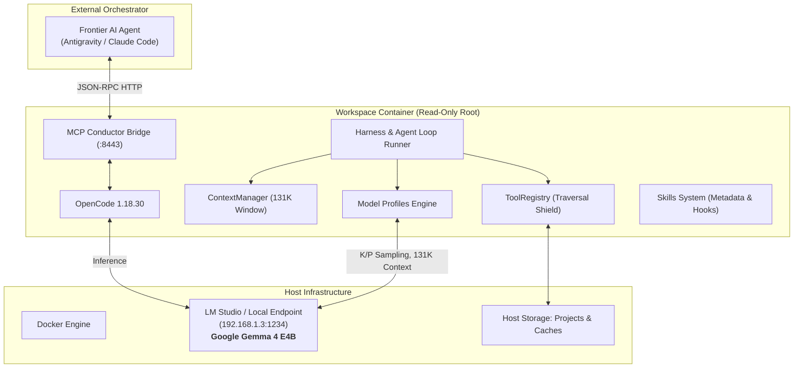

# Sandboxed OpenCode Architecture

A secure, containerized software development environment pairing local open-weights reasoning models with strict host isolation, agent loop harnesses, model profiles, and conductor orchestration.



---

## 1. Architectural Layers

### Layer 1: Container Hardening & Sandboxing
- **Read-Only Root Filesystem**: Protects system binaries from tampering.
- **Constrained Tmpfs Mounts**: Minimal ephemeral writes in `/tmp` and `/home/agent/.cache`.
- **Capability Dropping**: Drops `ALL` capabilities; only tightly scoped privileges (`CHOWN`, `SETUID`, `SETGID`, `KILL`) are re-added for allowlisted sudo helpers (`agent-apt-install`, `agent-kill-port`).
- **Seccomp Syscall Filter**: Blocks kernel modification, reboot, swap management, and `ptrace` exploits.
- **Resource Constraints**: Strict limits on memory (`8g`), CPUs (`4`), PIDs (`512`), and open file descriptors (`4096`).

### Layer 2: Network Topology & LLM Routing
- **Local Host**: Resolves `host.docker.internal` for collocated model servers.
- **LAN Private Routing**: Supports `LLM_HOST` (e.g. `192.168.1.3`) for routing to dedicated GPU inference nodes without enabling public internet exposure.
- **Restricted Mode (`make run-restricted`)**: Switches container to an internal bridge (`agent_network_restricted`) without WAN internet routing.

### Layer 3: Model Profiles & Resilient Client Framework
Declarative JSON specifications (`config/model_profiles/*.json`) defining optimal model hyperparameters:
- **Google Gemma 4 E4B**: 131K context window, `top_k=40`, `top_p=0.95`, `temperature=0.2`, reasoning trace isolation, strict OpenAI function schema calling.
- **Alibaba Qwen 3.5 9B**: 262K context window, dense reasoning and multimodal input handling.
- **Qwen 3 4B**: Ultra-lightweight local profile for low-memory environments.
- **Resilient Model Client (`harness/model_client.py`)**: Built-in exponential backoff retry loops, connection probing, and model pre-warming to handle GPU inference cold starts seamlessly.

### Layer 4: Harness & Agent Loop Engine
- **`ContextManager`**: Computes token usage, preserves critical anchors (system prompt + initial problem statement), and slides context history smoothly to fit within model boundaries.
- **`AgentLoopRunner`**: Multi-turn state machine orchestrating iterative coding, reasoning extraction, tool execution, and verification cycles.
- **`TaskEvaluator`**: Automated quality gate validating formatting (`ruff format`), static typing (`mypy`), linting (`ruff check`), and test suites (`pytest`).

### Layer 5: Extensibility (Skills, Tools, Plugins & Semantic Search)
- **Skills (`skills/`)**: Categorized procedural guides with standardized YAML frontmatter metadata.
- **Tools (`tools/`)**: Sandboxed operations with strict path traversal boundaries (`read_file`, `write_file`, `patch_file`, `grep_search`, `semantic_search`, `run_command`).
- **Offline Semantic Search (`harness/embeddings.py`)**: Pure-Python standard library cosine similarity and SQLite vector caching (`.cache/semantic_index.db`) using local embedding models (e.g. `text-embedding-nomic-embed-text-v1.5`) without external vector DB dependencies.
- **Plugins (`plugins/`)**: Pre/post execution hooks and telemetry loggers.

---

## 2. Operation Modes

| Mode | Trigger | Description | Use Case |
|---|---|---|---|
| **Interactive** | `make run` / `make run-tui` | Web browser UI on port 3000 or terminal TUI | Human-in-the-loop development & iterative pairing |
| **Autonomous** | `make run-autonomous` | Auto-approves all actions, executes markdown task end-to-end | Overnight features, refactors, and test generation |
| **Conductor** | `make run-conductor` | Headless OpenCode + MCP streamable HTTP bridge on port 8443 | External frontier AI agents orchestrating local sandbox |
| **Harness** | `make harness` | Direct programmatic Python harness loop and automated evaluation | Benchmarking, continuous evaluation, regression testing |

---

## 3. Operational Command Reference

```bash
make quickstart   # Zero-config auto-discovery of LM Studio / Ollama endpoints
make validate     # Validate .env and active model profile configuration
make check        # Run full security auditor (secrets, seccomp, port bindings)
make versions     # Inspect pinned software dependencies and active profile
make profiles     # List all available model profiles
make test-model   # Run live capabilities tests against LLM endpoint
make skills       # Discover and list registered skills
make harness      # Execute test harness evaluation loop
```
