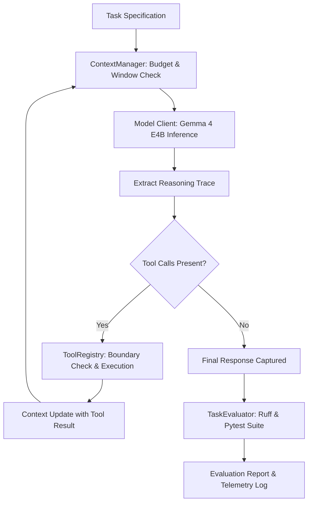

# Harnesses & Agent Loops Architecture

The Sandboxed OpenCode harness provides a self-contained execution loop, evaluation engine, and context budgeting manager for autonomous software engineering.

## The Agent Loop Lifecycle



## Core Modules

### 1. `harness/context.py` (`ContextManager`)
- **Context Capacity**: Tracks conversation tokens against the model profile's limit (e.g., 131,072 for Gemma 4).
- **Headroom Reservation**: Reserves 8,192 tokens for completions and reasoning.
- **Smart Sliding Window**:
  - Always retains Turn 0 (system prompt) and Turn 1 (initial user requirements).
  - Preserves the last $N$ turns (default 20).
  - Compresses or prunes intermediate turns when context exceeds `prune_threshold_tokens` (120,000 tokens).

### 2. `harness/model_client.py` (`ModelClient`)
- Interfaces directly with OpenAI-compatible inference servers (LM Studio, vLLM, Ollama).
- Implements Gemma 4 sampling (`top_k=40`, `top_p=0.95`, `temperature=0.2`).
- Automatically extracts `reasoning_content` and passes structured tool specifications.

### 3. `harness/runner.py` (`AgentLoopRunner`)
- Executes multi-turn iterative programming tasks.
- Manages step budgets (`max_steps_per_task`).
- Connects lifecycle hooks for telemetry and progress reporting.

### 4. `harness/evaluator.py` (`TaskEvaluator`)
- Automated quality gate after task execution:
  - Verifies expected artifacts exist.
  - Runs `ruff format --check .`
  - Runs `ruff check .`
  - Executes unit test suites with `pytest -v`.

---

## Running the Evaluation Harness

Execute an autonomous engineering task directly through the harness:

```bash
# Inline task instruction
python3 scripts/run_harness.py \
  --profile gemma-4-e4b \
  --task "Write a secure token generator in src/crypto.py and tests in tests/test_crypto.py"

# Or via Makefile
make harness TASK="Build and test JSON schema validator"
```
