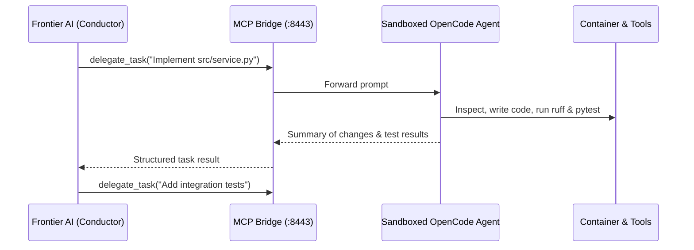

# Recipe: Conductor Mode Orchestration

Conductor mode connects external frontier models (Antigravity, Claude Code, Gemini CLI) to the local sandboxed agent via a secure JSON-RPC MCP bridge.

## Architecture



## Step 1: Start Conductor Mode
```bash
make run-conductor
```
The bridge listens on `http://127.0.0.1:8443/mcp`.

## Step 2: Configure Your External Agent
Add the MCP bridge to your frontier agent's MCP configuration:

```json
{
  "mcpServers": {
    "sandboxed-opencode": {
      "url": "http://127.0.0.1:8443/mcp",
      "transport": "streamable-http"
    }
  }
}
```

## Step 3: Available Conductor Tools
- `delegate_task(instructions)`: Send instructions to the local agent.
- `read_project_file(path)`: Inspect any file within the sandbox.
- `write_project_file(path, content)`: Directly write files.
- `patch_project_file(path, find_text, replace_text)`: Apply surgical replacements.
- `run_project_command(command)`: Run builds, linters, and tests.
- `get_project_diff()`: Review git changes.
- `get_model_profile()`: Check the local model's parameters and context limits.
- `list_skills()`: Check crystallized skills in the project.
