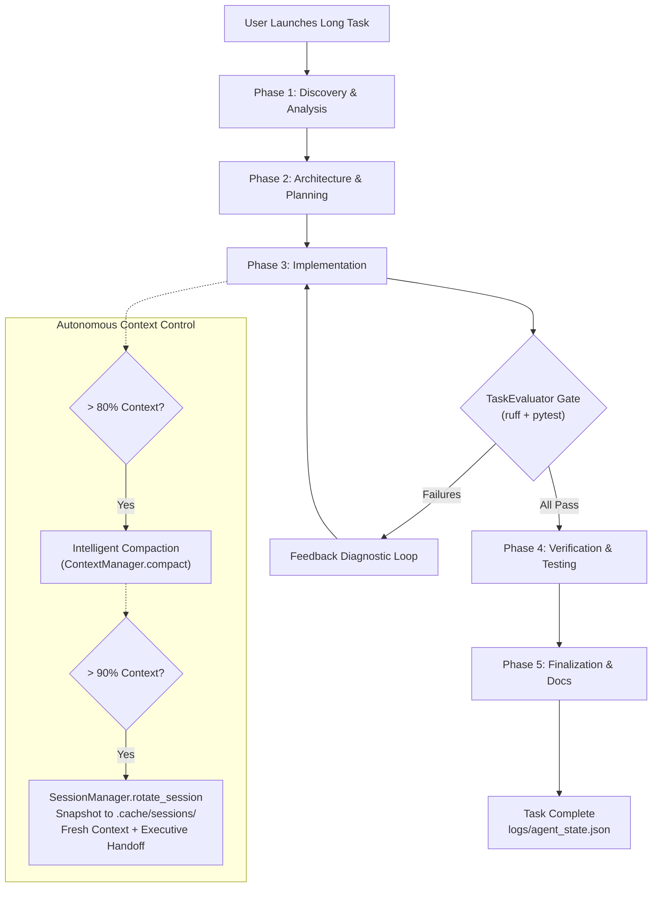

# Recipe: Unattended Long Tasks & Session Rotation

This recipe describes how to execute complex, multi-phase software engineering tasks unattended using the `LongTaskSupervisor`, intelligent context compaction, and automatic session rotation.

---

## 1. Overview & Problem

Frontier reasoning models like **Google Gemma 4 E4B** excel at planning, tool calling, and deep step-by-step reasoning. However, ambitious software engineering tasks—such as building a complete microservice, refactoring legacy components, or implementing a full test suite—often require dozens of turns.

Without session supervision, long-running agent loops encounter:
1. **Context Saturation**: Context window fills up, causing slower inference or token overflow errors.
2. **Context Degradation**: Too much verbose tool output dilutes the initial task objectives.
3. **Loss of Direction**: Unattended agents can get trapped in repetitive error loops.

`sandboxed-opencode` solves this with the `LongTaskSupervisor` and `SessionManager`:
- **Phased Execution**: Breaks tasks into structured phases (`Discovery`, `Architecture`, `Implementation`, `Verification`, `Finalization`).
- **Proactive Context Compaction**: When context reaches >80% utilization, intermediate tool calls and chatter are distilled into a compact architectural checkpoint, preserving 100% of critical decisions while reclaiming headroom.
- **Automatic Session Rotation**: When context nears capacity (>90%) or upon completing major phases, the supervisor snapshots state to `.cache/sessions/`, creates an **Executive Session Handoff**, and boots a clean session with full token headroom to continue working unattended.
- **Continuous Quality Gate**: Runs `TaskEvaluator` (Ruff formatting, linting, and Pytest) during verification, feeding automated diagnostics back to the model for self-correction.

---

## 2. Launching an Unattended Task

### Via Makefile
```bash
make supervisor TASK="Implement an offline caching layer with LRU eviction and 100% pytest test coverage"
```

Or provide a markdown task specification file:
```bash
make supervisor TASK_FILE=tasks/my_large_feature.md
```

### Via Python CLI Directly
```bash
python3 scripts/run_supervisor.py \
  --profile gemma-4-e4b \
  --host 192.168.1.3 \
  --port 1234 \
  --task "Build full semantic indexer with persistence"
```

---

## 3. How the Supervisor Works



---

## 4. Observing Progress in Real Time

### 1. Terminal Telemetry Dashboard
Generate or view the visual dashboard:
```bash
make dashboard
```
Open `/tmp/dashboard-public/index.html` or view it at `http://localhost:8080`.

The dashboard visualizes:
- **Active Session ID** (e.g. `task_172605_s002`).
- **Context Window Utilization Gauge** with colored thresholds (Green `<65%`, Yellow `65-85%`, Red `>85%`).
- **Token Velocity**: Generation speed in completion tokens per second (`t/s`).
- **Reasoning Ratio**: Percentage of output dedicated to internal thought processes (`reasoning_tokens / completion_tokens`).
- **Phased Milestones Checklist**: Live status of each phase (`Completed`, `In Progress`, `Pending`).
- **Tool Invocation Breakdown**: Frequency and latency per tool.

### 2. State and Checkpoint Files
The supervisor writes ongoing state to disk:
- `logs/agent_state.json`: Summary of all completed phases, total steps, and execution metrics.
- `logs/agent_telemetry.json`: Granular per-step latencies, token counters, and milestones.
- `.cache/sessions/session_*.json`: Full historical snapshots of previous sessions.
